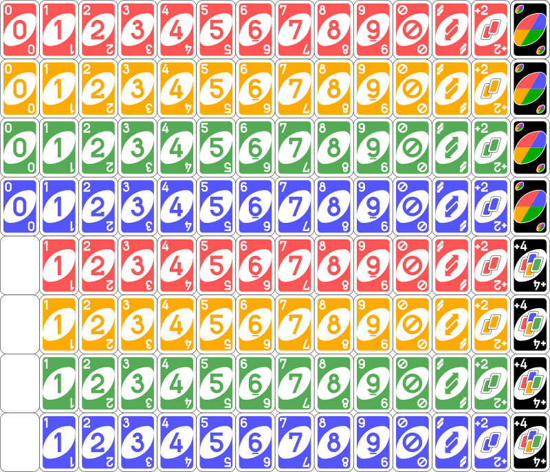

# UNO-game-agent
An agent that plays the UNO game

# Deck
Uno deck based on 

# Running the code
Expected output:
```
[uriegas@Dell UNO-game-agent]$ python UNO.py
           )     )   
        ( /(  ( /(   
    (   )\()) )\())  
    )\ ((_)\ ((_)\   
 _ ((_) _((_)  ((_)  
| | | || \| | / _ \  Welcome to UNO GAME from terminal.
| |_| || .` || (_) | You are playing against a machine.
 \___/ |_|\_| \___/  
                     

Machine cards{
    UnoCard{ color: yellow, special: blockNextPlayer }
    UnoCard{ color: green, number: 3 }
    UnoCard{ color: blue, special: reverse }
    UnoCard{ color: red, special: plusFour }
    UnoCard{ color: red, number: 1 }
    UnoCard{ color: yellow, number: 0 }
    UnoCard{ color: green, number: 5 }
    UnoCard{ color: green, number: 8 }
}

Your cards{
    UnoCard{ color: green, number: 0 }
    UnoCard{ color: red, special: plusTwo }
    UnoCard{ color: blue, number: 6 }
    UnoCard{ color: red, special: blockNextPlayer }
    UnoCard{ color: yellow, number: 4 }
    UnoCard{ color: yellow, special: reverse }
    UnoCard{ color: yellow, special: plusTwo }
    UnoCard{ color: green, number: 1 }
}

Current card: UnoCard{ color: green, number: 1 }

Your turn > 
```

# TODO
At the moment the code is fixed to work only for 2 players, it would be desirable to make the code work with multiplayers
Special powers aren't implemented yet.

* Differentiate selected card vs new card (eat card) in terminal